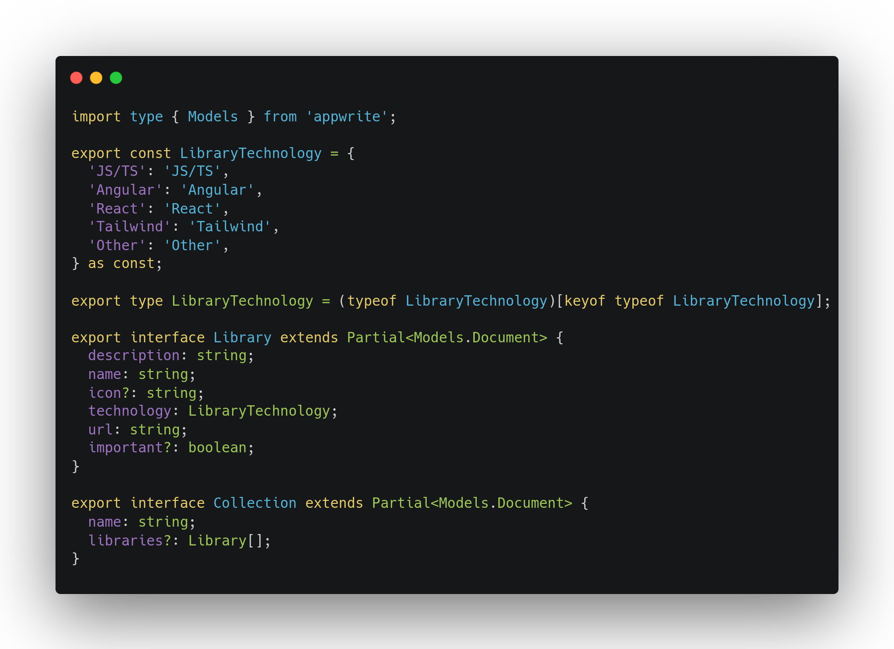

# Appwrite Collection Builder

This project generates TypeScript models for Appwrite collections based on a configuration file.

## Usage

To generate the TypeScript models, run the following command:

```sh
"scripts": {
  ...
  "codegen": "appwrite-typescript --config path/to/config.json --output models.ts --directory ./types"
}
```

## Configuration

The configuration file should be a JSON file with the following structure:

```json
{
  "endpoint": "https://[HOSTNAME_OR_IP]/v1",
  "projectId": "YOUR_PROJECT_ID",
  "apiKey": "YOUR_API_KEY",
  "databaseId": "YOUR_DATABASE_ID"
}
```

- `endpoint`: The endpoint of your Appwrite server.
- `projectId`: The ID of your Appwrite project.
- `apiKey`: Your Appwrite API key.
- `databaseId`: The ID of the database containing the collections.

## Example

Here is an example of how to run the script:

```sh
npx appwrite-typescript --config ./config.json --output models.ts --directory ./output
```

## Options

- `--config`: Path to the configuration JSON file.
- `--output`: Name of the output TypeScript file.
- `--directory`: Directory where the output file will be saved.
- `--enumType`: The type of enums to generate. Possible values are `native` and `object`. Default is `object`.

## Results

The script will generate a TypeScript file similar to this:


